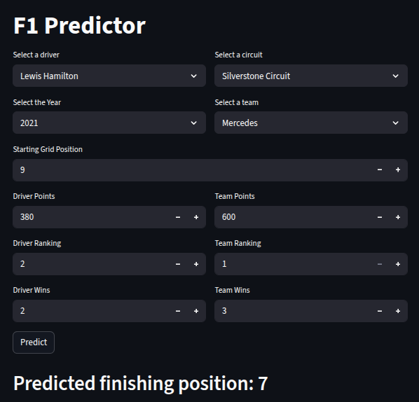
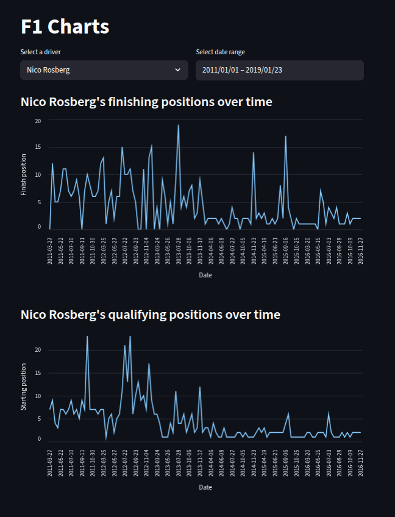
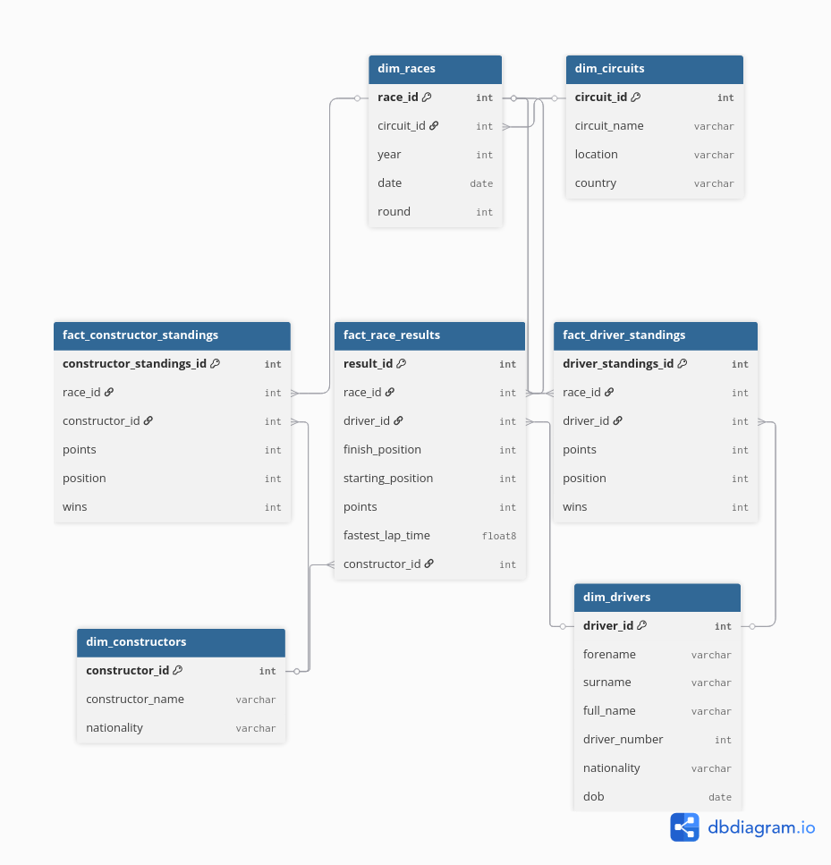

# Formula 1 Project

An interactive web application that predicts Formula 1 race outcomes and visualises driver performance over time. 






## Features 
- ETL pipeline to extract, transform and load data into a star schema postgreSQL database 
- Race predictor outcome, trained using Scikit-learn model 
- Streamlit Web App 
- FastAPI backend 
- Containerised using Docker 


## Tech Stack 
**Language:** Python

**Web Framework:** Streamlit, FastAPI

**Data Pipeline:** Pandas, pg8000

**Database:** PostgresSQL

**Machine Learning:** Scikit-learn 

**Deployment:** Docker


## Setup Instructions 

You will need Python 3 and Docker installed on your system. 

- Get started by forking and cloning this repository. 
- Before running the project, create a file named `.env` in the project root with the following content:

```
POSTGRES_DB=f1_database
POSTGRES_USER=postgres
POSTGRES_PASSWORD=postgres
POSTGRES_PORT=5432
POSTGRES_HOST=postgres
```
- In the terminal run the following:
```
docker compose up 
```
- Once containers are running, open your browser and go to:
```
http://0.0.0.0:8001
```

## How it works
- **ETL pipeline:** Formula 1 race data (1950–2024) was sourced from (https://www.kaggle.com/datasets/jtrotman/formula-1-race-data). The data was cleaned and transformed using pandas, before being loaded into a star schema PostgreSQL database using pg8000. 
**ERD of the database:**

    

- **Machine Learning Model:** Data was pulled from the database using pg8000 and loaded into dataframes to train a machine learning model to predict final finishing position using Scikit-learn. The model was trained on race data, constructor standings and driver standings. 

- **FastAPI Backend:** Exposes two api endpoints: 

    **POST /predict** 

    - Accepts driver name, circuit name, season year, starting position, driver/team points, rankings, and win counts.
    - Returns a predicted race outcome.

    **GET /chart**

    - Accepts driver name and date range.
    - Returns historical driver performance data between two dates.

- **Streamlit Web App**: Provides an interactive UI for users to:
   - Predict race outcomes
   - Visualize driver performance trends over time

- **Dockerized Deployment**: All components (DB, API, UI) are containerized using Docker and orchestrated with Docker Compose for easy setup and reproducibility.